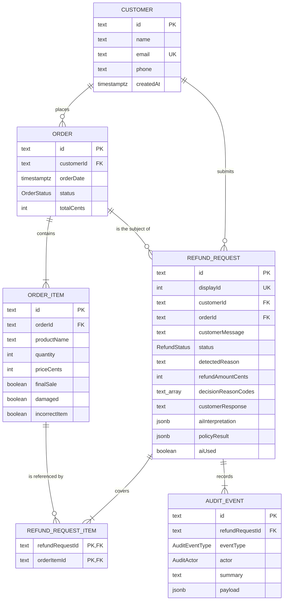

# Data Model

PostgreSQL 16 with Prisma. The schema lives in `apps/api/prisma/schema.prisma`; migrations in
`apps/api/prisma/migrations/`; the synthetic dataset in `apps/api/prisma/seed.ts`.

---

## 1. Entity relationship

```text
Customer 1 ──── n Order
   │                │
   │                └──── 1 ──── n OrderItem
   │                                  │
   │                                  └──── n ──── n RefundRequest  (RefundRequestItem)
   │
   └──── 1 ──── n RefundRequest 1 ──── n AuditEvent
```

| Relation | Cardinality | Cascade |
|---|---|---|
| Customer → Order | one to many | restrict |
| Order → OrderItem | one to many | restrict |
| Customer → RefundRequest | one to many | restrict |
| Order → RefundRequest | one to many | restrict |
| RefundRequest ↔ OrderItem | many to many via `RefundRequestItem` | cascade on request delete |
| RefundRequest → AuditEvent | one to many | cascade on request delete |

---

## 2. `Customer`

| Column | Type | Notes |
|---|---|---|
| `id` | `text` | Primary key, `CUST-001` … `CUST-015` |
| `name` | `text` | Display name; the first name is used in the composed reply |
| `email` | `text` | Unique, synthetic `*.example.test` addresses |
| `phone` | `text?` | Present in the model for realism, never exposed by the API |
| `createdAt` | `timestamptz` | Default `now()` |

There is no credential column. The customer switcher is the demo stand-in for authentication, and
the API is the only way to reach order data.

## 3. `Order`

| Column | Type | Notes |
|---|---|---|
| `id` | `text` | Primary key, `ORD-1001` … |
| `customerId` | `text` | Foreign key to `Customer`, indexed |
| `orderDate` | `timestamptz` | Drives the refund window; seeded relative to seed time |
| `status` | `OrderStatus` | `PROCESSING`, `SHIPPED`, `DELIVERED`, `CANCELLED` |
| `totalCents` | `integer` | Sum of item price × quantity; informational |
| `createdAt`, `updatedAt` | `timestamptz` | |

Only `DELIVERED` orders are refund-eligible (rule D1).

## 4. `OrderItem`

| Column | Type | Notes |
|---|---|---|
| `id` | `text` | Primary key, `ITM-1001-1` |
| `orderId` | `text` | Foreign key to `Order`, indexed |
| `productName` | `text` | The only item text ever sent to the model |
| `quantity` | `integer` | Refund amount is whole-item: `priceCents × quantity` |
| `priceCents` | `integer` | Unit price in cents |
| `finalSale` | `boolean` | Default `false`; drives rule D3 |
| `damaged` | `boolean` | Default `false`; **verified CRM record**, compared against the customer's claim |
| `incorrectItem` | `boolean` | Default `false`; same semantics as `damaged` |

`damaged` and `incorrectItem` are the crux of the safety model. They represent what the warehouse
or the carrier recorded, not what the customer asserted. A claim of damage that is not backed by
`damaged = true` fires rule E2 (`CLAIM_CONTRADICTS_RECORDS`) and escalates instead of approving.

## 5. `RefundRequest`

| Column | Type | Notes |
|---|---|---|
| `id` | `text` | Primary key, `cuid()` |
| `displayId` | `serial` | Unique, auto-incrementing; shown to humans as `RF-0001` |
| `customerId` | `text` | Foreign key, indexed |
| `orderId` | `text` | Foreign key, indexed |
| `customerMessage` | `text` | Sanitised customer text, 1–1000 characters |
| `status` | `RefundStatus` | Default `PENDING` |
| `detectedReason` | `text?` | `DAMAGED`, `INCORRECT_ITEM`, `CHANGED_MIND`, `OTHER`, `UNCLEAR`, or `null` when the AI was unavailable |
| `refundAmountCents` | `integer?` | Computed from the database; `null` while `PENDING` |
| `decisionReasonCodes` | `text[]` | Fired rules of the winning category, in evaluation order |
| `customerResponse` | `text?` | The exact text returned to the customer |
| `aiInterpretation` | `jsonb?` | The validated interpretation object, or `null` |
| `policyResult` | `jsonb?` | Verdict, amount, reason codes and all twelve rule results |
| `aiUsed` | `boolean` | Default `false`; `false` counts as an AI failure on the dashboard |
| `createdAt`, `updatedAt` | `timestamptz` | |

Indexes: `(status, createdAt)` for the filtered list, plus `customerId` and `orderId` for ownership
and duplicate checks.

### Why `policyResult` is JSON

The admin drawer needs every rule with its fired flag and a human-readable detail string. Storing
that as JSON keeps the table stable when rules are added, keeps the write to a single row, and
lets the dashboard answer "how many requests tripped E1?" with one containment query instead of a
new column and a second source of truth. The alternative — a normalised `policy_checks` table — was
rejected because nothing queries individual rules except the detail view, and the audit trail
already stores the same information in normalised form.

## 6. `RefundRequestItem`

| Column | Type | Notes |
|---|---|---|
| `refundRequestId` | `text` | Part of the composite primary key |
| `orderItemId` | `text` | Part of the composite primary key, indexed |

This join table records exactly which items a request covers. Two consequences:

* the refund amount is always the sum over the selected items, never the order total;
* "already refunded" is derived by joining to `RefundRequest.status = 'APPROVED'`, so there is no
  separate refunded flag that could drift out of sync.

## 7. `AuditEvent`

| Column | Type | Notes |
|---|---|---|
| `id` | `text` | Primary key, `cuid()` |
| `refundRequestId` | `text` | Foreign key, indexed together with `createdAt` |
| `eventType` | `AuditEventType` | One of eight types |
| `actor` | `AuditActor` | `CUSTOMER`, `SYSTEM`, `AI`, `POLICY_ENGINE`, `ADMIN` |
| `summary` | `text` | One line, safe to display |
| `payload` | `jsonb?` | Structured, non-sensitive context |
| `createdAt` | `timestamptz` | Ordering key |

Append-only by construction: the repository exposes `create` and `createMany` and nothing else.
The application never issues an update or a delete against this table.

### Payloads by event

| Event | Payload keys |
|---|---|
| `REQUEST_RECEIVED` | `customerId`, `orderId`, `itemIds`, `messageLength` |
| `INPUT_SCREENED` | `normalized`, `removedCharacters`, `changed`, `suspicious`, `matchedPatternIds` |
| `AI_INTERPRETATION` | `provider`, `model`, `latencyMs`, `intent`, `reason`, `confidence`, `injectionSuspected`, `matchedItemIds`, `droppedItemIds`, `summary`, or `failed` + `kind` |
| `POLICY_EVALUATED` | `refundAmountCents`, `rules[]`, `config`, `recomputedUnderLock` |
| `DECISION_MADE` | `decision`, `refundAmountCents`, `reasonCodes`, `signals`, `aiLatencyMs` |
| `AI_RESPONSE_GENERATED` | `model`, `wordCount` |
| `AI_FALLBACK_USED` | `reason`, `model` |
| `ERROR` | `stage`, `kind`, `rawOutput` (truncated) |

The full customer message is never copied into an audit payload; only its length is. Phone numbers
and API keys never appear anywhere in the table.

---

## 8. Enumerations

```prisma
enum OrderStatus  { PROCESSING SHIPPED DELIVERED CANCELLED }
enum RefundStatus { PENDING APPROVED DENIED ESCALATED }
enum AuditActor   { CUSTOMER SYSTEM AI POLICY_ENGINE ADMIN }
enum AuditEventType {
  REQUEST_RECEIVED INPUT_SCREENED AI_INTERPRETATION POLICY_EVALUATED
  DECISION_MADE AI_RESPONSE_GENERATED AI_FALLBACK_USED ERROR
}
```

The same values are mirrored in `packages/shared-types/src/enums.ts` so the web client can compare
them without importing Prisma. The unit tests assert that the two stay in step.

---

## 9. Money handling

* Stored as `integer` cents everywhere: prices, order totals, refund amounts, the policy threshold.
* Converted to a decimal only at the formatting boundary (`Intl.NumberFormat` on the client,
  `formatUsd` for audit strings).
* The `$500.00` boundary is therefore exact: `50000 > 50000` is false, `50100 > 50000` is true, with
  no floating-point drift. The boundary is covered by unit tests on both sides.
* No payment integration exists. An approval is a recorded decision, not a money movement.

---

## 10. Seed dataset

`seedDatabase()` in `apps/api/prisma/seed.ts` creates 15 customers with 16 orders and 24 items, plus
one historical `APPROVED` refund for CUST-011. It is idempotent: every write is an upsert keyed by
the fixed id, and the historical refund is created only when it does not already exist.

Order dates are computed relative to seed time (`now - N days`, truncated to midnight UTC), so the
30/31-day boundary cases remain valid whenever the stack starts.

| Customer | Order | Setup | Expected |
|---|---|---|---|
| CUST-001 | ORD-1001 | Headphones $129, 7 days, `damaged` | `APPROVED` (A1) |
| CUST-002 | ORD-1002 | Clearance jacket $89, `finalSale` | `DENIED` (D3) |
| CUST-003 | ORD-1003 | Laptop $900, 4 days, `damaged` | `ESCALATED` (E3) |
| CUST-004 | ORD-1004 | Sneakers $75, 45 days | `DENIED` (D4) |
| CUST-005 | ORD-1005 | Blender $60, `incorrectItem` | `APPROVED` (A1) |
| CUST-006 | ORD-1006 | Smartwatch $210, no damage on record | `ESCALATED` (E2) |
| CUST-007 | ORD-1007 | Backpack $80 + sunglasses $45 `finalSale` | `APPROVED` (A2) / `DENIED` (D3) |
| CUST-008 | ORD-1008 | Monitor $500.00, 5 days, `damaged` | `APPROVED` (boundary) |
| CUST-009 | ORD-1009 | Tablet $501.00, 5 days, `damaged` | `ESCALATED` (boundary) |
| CUST-010 | ORD-1010 / ORD-1011 | 30 days / 31 days | `APPROVED` / `DENIED` (boundary) |
| CUST-011 | ORD-1012 | Prior `APPROVED` refund exists | `DENIED` (D2) |
| CUST-012 | ORD-1013 | Status `SHIPPED` | `DENIED` (D1) |
| CUST-013 | ORD-1014 | Espresso machine $250, `finalSale` | `DENIED` (D3) + injection flagged (E1) |
| CUST-014 | ORD-1015 | Two items, vague message | `ESCALATED` (E4, E5) |
| CUST-015 | ORD-1016 | $60 item, customer claims $300 | `ESCALATED` (E2) |

The seed is executed by the API container on every start and by `npm run db:seed` locally.

---

## 11. Migrations

```text
apps/api/prisma/migrations/
├── migration_lock.toml
└── 20260101000000_init/migration.sql
```

`prisma migrate deploy` applies pending migrations at container start, before the seed and before
the server listens. The migration creates the schema, four PostgreSQL enums, five tables, the
composite primary key on `refund_request_items`, all indexes and all foreign keys.

**Never use `migrate dev` against the running database** — it wants to reset the schema. Use:

```bash
npm run prisma:generate            # regenerate the client after a schema change
npm run db:migrate                 # prisma migrate deploy
npm run db:seed                    # idempotent seed
```

To add a migration after editing `schema.prisma`:

```bash
cd apps/api
npx prisma migrate dev --name describe_your_change   # local development only
```

and commit the generated folder.

---

## 12. Query patterns

| Use case | Query | Index used |
|---|---|---|
| Customer orders picker | `order.findMany({ where: { customerId } })` | `orders_customerId_idx` |
| Ownership check | `order.findFirst({ where: { id, customerId } })` | primary key |
| Admin list with filter | `refundRequest.findMany` + `count` in one transaction | `refund_requests_status_createdAt_idx` |
| Already refunded | `refundRequestItem.findMany({ where: { orderItemId: { in }, refundRequest: { status: 'APPROVED' } } })` | `refund_request_items_orderItemId_idx` |
| Dashboard counters | `refundRequest.groupBy({ by: ['status'] })` | covered by the status index |
| Suspicious count | `jsonb` containment on `policyResult` | sequential scan over a small table |
| Audit timeline | `auditEvent.findMany({ where: { refundRequestId }, orderBy: [{ createdAt }, { id }] })` | `audit_events_refundRequestId_createdAt_idx` |

The list endpoint runs the page query and the count inside a single `$transaction` so the pagination
metadata always matches the rows that were returned.

---

## 13. Privacy and retention

* All data is synthetic. No real customer, order or payment data is present in the repository.
* `phone` is never returned by any endpoint and never written to an audit payload.
* The pino logger redacts `authorization`, cookies, API keys, emails and phone numbers.
* Customer messages are stored because the decision must be auditable; they are not written to logs
  at info level.
* There is no automated retention job. A production deployment would define one for
  `refund_requests` and `audit_events` together, since the audit trail is only meaningful for as
  long as the decisions it explains.

---

## 14. Entity diagram



---

## 15. Column reference

### `customers`

| Column | Type | Null | Default | Key |
|---|---|---|---|---|
| `id` | `text` | no | — | PK |
| `name` | `text` | no | — | |
| `email` | `text` | no | — | unique |
| `phone` | `text` | yes | — | |
| `createdAt` | `timestamptz(3)` | no | `now()` | |

### `orders`

| Column | Type | Null | Default | Key |
|---|---|---|---|---|
| `id` | `text` | no | — | PK |
| `customerId` | `text` | no | — | FK → `customers.id`, indexed |
| `orderDate` | `timestamptz(3)` | no | — | |
| `status` | `OrderStatus` | no | — | |
| `totalCents` | `integer` | no | — | |
| `createdAt` | `timestamptz(3)` | no | `now()` | |
| `updatedAt` | `timestamptz(3)` | no | — | managed |

### `order_items`

| Column | Type | Null | Default | Key |
|---|---|---|---|---|
| `id` | `text` | no | — | PK |
| `orderId` | `text` | no | — | FK → `orders.id`, indexed |
| `productName` | `text` | no | — | |
| `quantity` | `integer` | no | — | |
| `priceCents` | `integer` | no | — | |
| `finalSale` | `boolean` | no | `false` | |
| `damaged` | `boolean` | no | `false` | |
| `incorrectItem` | `boolean` | no | `false` | |

### `refund_requests`

| Column | Type | Null | Default | Key |
|---|---|---|---|---|
| `id` | `text` | no | `cuid()` | PK |
| `displayId` | `serial` | no | autoincrement | unique |
| `customerId` | `text` | no | — | FK → `customers.id`, indexed |
| `orderId` | `text` | no | — | FK → `orders.id`, indexed |
| `customerMessage` | `text` | no | — | |
| `status` | `RefundStatus` | no | `PENDING` | indexed with `createdAt` |
| `detectedReason` | `text` | yes | — | |
| `refundAmountCents` | `integer` | yes | — | |
| `decisionReasonCodes` | `text[]` | no | — | |
| `customerResponse` | `text` | yes | — | |
| `aiInterpretation` | `jsonb` | yes | — | |
| `policyResult` | `jsonb` | yes | — | |
| `aiUsed` | `boolean` | no | `false` | |
| `createdAt` | `timestamptz(3)` | no | `now()` | |
| `updatedAt` | `timestamptz(3)` | no | — | managed |

### `refund_request_items`

| Column | Type | Null | Key |
|---|---|---|---|
| `refundRequestId` | `text` | no | PK (1/2), FK → `refund_requests.id`, cascade delete |
| `orderItemId` | `text` | no | PK (2/2), FK → `order_items.id`, indexed |

### `audit_events`

| Column | Type | Null | Default | Key |
|---|---|---|---|---|
| `id` | `text` | no | `cuid()` | PK |
| `refundRequestId` | `text` | no | — | FK → `refund_requests.id`, cascade delete, indexed with `createdAt` |
| `eventType` | `AuditEventType` | no | — | |
| `actor` | `AuditActor` | no | — | |
| `summary` | `text` | no | — | |
| `payload` | `jsonb` | yes | — | |
| `createdAt` | `timestamptz(3)` | no | `now()` | |

---

## 16. Write path and transaction boundaries

A refund request performs two transactions and reads several times. Knowing the boundaries explains
both the consistency guarantees and the latency.

```text
read   customer                                   (ownership)
read   order + items for customer                 (ownership + trusted facts)
read   previously refunded item ids               (rule D2)
── transaction 1 ───────────────────────────────────────────────────────────
write  refund_requests            INSERT, status PENDING
write  audit_events               INSERT ×2  (REQUEST_RECEIVED, INPUT_SCREENED)
── AI interpretation (no transaction held) ──────────────────────────────────
read   order + items              (in-memory from the first read)
pure   evaluateRefund()
call   provider.compose()
── transaction 2 ───────────────────────────────────────────────────────────
lock   SELECT … FOR UPDATE on orders
read   refund_request_items joined to APPROVED requests   (rule D2 again)
write  refund_requests            UPDATE with verdict, amount, codes, response
write  audit_events               INSERT ×3  (POLICY_EVALUATED, DECISION_MADE,
                                               AI_RESPONSE_GENERATED | AI_FALLBACK_USED)
──────────────────────────────────────────────────────────────────────────────
```

Holding a row lock across a network call to a model would serialise the whole system on the slowest
AI latency, so the model is called between the two transactions. The consequence is handled
explicitly: if the second rule-D2 check finds a refund that was approved while the model was
running, the policy is recomputed with the fresh facts and the deterministic template is used
instead of a second model call. The recomputation is recorded in the `POLICY_EVALUATED` payload as
`recomputedUnderLock: true`, so the audit trail shows that it happened.

---

## 17. Size expectations

| Table | Rows after seeding | Rows after a demo session | Notes |
|---|---|---|---|
| `customers` | 15 | 15 | Never grows in the demo |
| `orders` | 16 | 16 | |
| `order_items` | 24 | 24 | |
| `refund_requests` | 1 | 25–40 | One row per submission |
| `refund_request_items` | 1 | 25–40 | One row per selected item |
| `audit_events` | 2 | 150–250 | Two to six events per request |

At this scale every query is an index lookup or a small sequential scan, which is why the dashboard
can afford a `groupBy` plus a `jsonb` containment count on every poll. The first index to add if
the table grows is a partial index on `status` for non-terminal rows, and then a `GIN` index on
`policyResult` once the suspicious count stops being cheap.
